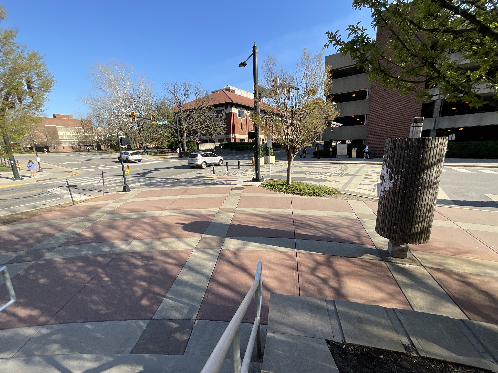

# Human Observation

I tend to act very differently when I am stressed. This is not to say that I'm not good at handling stress; but rather that I am frighteningly good at doing so without crumbing down to bits and dusts.

The days of last week are fitting examples. Research meetings, papers to read, homework to do, and a blasted late-term exam, all piled up together driving me to the verge of insanity. And my response to this heap of annoyance is, well, something I cannot fathom doing while not under extreme stress.

That is, sitting on the stairs in front of Lawson, bathing in sunlight, watching people come and go across the crossroad, without a single care in mind. Call this ***Human Observation***.

Let's talk a bit about such minute trivialities today.

---

I find human-watching a fascinating activity. It's like birdwatching, but with humans instead.

How different one person is from another; And how insignificant this difference is; These are questions to which you can find answers gradually as you observe humans. For the former, just look at that crossroad, with thousands of people crossing by each day. You cannot find two people who are the same. How they dress, how they talk, how they act, and how they think, are all distinct from each other, and each of them is unique.

But raising our perspective to a higher, more macroscopic vantage point: We are not so different from each other after all. No one can escape the laws of nature, be it life or death, joy or loss. We as humans are but passerbys riding the boat, insignificant and indifferent to the river of time. On this grand scale of things, I am not so different from those I observe after all, so this, while a fair point, is not really the reason that I enjoy human observation so much.

So let us pull back a little bit from seeing through the eyes of the universe, and settle into my eyes instead. From this perspective as an observer, there are both a sense of conformity and a sense of distinctness to be found within the passing crowd, interpolating between individual characteristics and the grand indifference of the universe. For example, they are simply all simply passing by this crossroad, unlike me who have the leisure and desire to settle down on the stairs, watching people walking around, watching time flow by. And most of them are not fighting snakes for a PhD degree.

---

Those who know who I am or have read what I'd wrote even for just a little bit would know that my philosophy system is overall a humanitarian one. My belief is that the potential of humanity is paramount, and undeniably what makes us human.

From such a humanitarian perspective, it is to no surprise that I would find the act of human observation so enjoyable. What would be a better way to appreciate the human race, not only as a whole, but also as many unique individuals?

Only when we watch over the human race as a whole can we make observations about our history, society, and trend. As I sit on the stairs and watch over the cross, within just a week's time I can feel the increase of pedestrians resorting to short-sleeved clothings to account for the arrival of spring; once in a while a group will walk by in strange exotic costumes, doing hilarious things beyond my comprehension, and as I watch I wonder if something interesting is happening elsewhere on campus. These are really insignificant examples compared to what our history, society, and trend really is about, as after all I do not have the time to kill besides the front door for years at a time; but within a day or two, at least I can already see some changes flowing in the wind.

In the mean while, as I set my sight on the crowd, all I see are unique human beings to sate my curiosity: some in shorts and shirts, already prepared for the encroaching summer; some still holding on to their winter coat, their expressions filled to the brim with regret and frustration over why they did not bother checking the weather before going out. Such is the fun part of human observation, one that is hardly describable by mere words. Zoos are great destinations for vacation, since you can see the animals that you cannot normally encounter in your day-to-day life; I find the cross over here not that different after all.  

As I look over these people, my mind would inevitably start to wander and wonder. You are looking ecstatic today - what nice things are happening in your life? You wear clothes fit for a formal interview - is that the case, or are you out on a date with someone you're looking forward to meeting? You are clenching your winter coat in this shirt-and-shorts weather - what's wrong with you and what's wrong with looking at the weather beforehand? The list goes on and on - each passenger has their own story, their own life to live, their own unique contribution to the story of our kind. I'm admittedly not deranged enough to be a social terrorist and interview each and everyone passing through about their life stories, but I'm also not timid enough to allow societal constraints and the distance between one mind and another to hamper me from wandering with my own thoughts, and taking pleasure from it.

---

Purdue is a huge university. Most people walking through this cross I do not know, and most likely will not ever get to know in the rest of my life. They are but passerbys, like a transient comet, sweeping through the edge of my attention, under the hazing sunshine of such a spring afternoon, obfuscated by the commotion of the crossing road. And I think this is fine enough.

Once in a while, a friend I know, or a faculty I'm familiar with, will travel through the cross, or exit the building behind me. We wave and greet and say our hellos, and retreat to our own musings - let them head to where they need to be, and let me watch for the people I am interested in. And I think this is fine enough.

As I sit and ruse, it becomes more and more obvious and felt to me that Purdue is quite different from the places that I used to be. At CMU, and I dare say the entire city of Pittsburgh, give me a crossing and let me hang around for a dozen of minutes, I can guarantee that I find someone I've known during my time there. After all, CMU is such a smaller place compared to Purdue. Once I left for Purdue, there's no longer that fantastically intriguing feeling of meeting old friends in strange places, which can be unfortunately.

On one hand, this can be attributed to the population difference between Purdue and CMU; On the other, as I delve into the specific fields of academic research, there are less and less people that I would interact with on a daily basis. No longer do I have the opportunity to talk to and make friends with students from various backgrounds and interests in the GenEd courses. So I watch strangers of various shapes and colors walk by, and inevitably feel the insignificance of each of us as individuals, and a slight hint of loneliness and frustration.

But once again, this does not stop me from taking pleasure in human observation.

---

I do suppose that I somewhat enjoy wandering amongst the crowd as an ***observer***. Even with the explicit realization that the observer is different from the observed, that I am different from the others, I have managed to find a small sense of belonging within this identification and take satisfaction from it.

Human observation is indeed a very transcendent activity, in some sense. I, as the observer, isolate myself from the wholeness of humankind, and watch from a bird-eye's view. And as I watch, I ruminate over what I see and hear and feel, translating them into either internalized thoughts, or some form of pure meaningless joy.

This is admittedly one of the reasons I enjoy human observation. Who would have the courage and leisure to bother with someone sitting quietly on top of the stairs, watching over the passing crowd, and over the horizon in the distance? I am fond of this kind of time in which I can care not about other people and things, and the serenity it brings me. I sit amongst the echoing crowd, but my mind and heart are still like water.

But in the meanwhile, I don't think this implies that I'm an introverted person. I'm not exactly an introverted person. I love talking to people about topics serious or trivial, and if I ever find the right topic with the right people, the box of pandora opens and the world will witness the chatterbox that I am.

It is quite contradictory, isn't it. I'm quite a contradictory person after all.

I have a lot of friends who are very outgoing and extraverted, standing at the pinnacle of societal abilities. They can easily insert themselves into any group of individuals, no matter the topic and the prior, and take control of the conversation, pulling it into their track. On the contrary, I'm not quite someone who likes to be revolved around, who likes to be under the spotlight at all times. I prefer more to observe the conversation quietly and silently on my own, almost as if lurking under the water within the crowd.

That being said, no matter what you or others would think, I believe that I am someone who is still very good at joining and blending in with any group of people, taking on the role of an observer within them. It suffices to listen to their conversations, consider their opinions, and chiming in with my own at the right time, and express myself when it is necessary. We share a silent acknowledgement of each other. And I think this is fine enough.

---

The weather that day is just awesome. I met up with an old friend I haven't talked to in a while, got a cup of coffee from Starbucks, and had small chats while we walked around campus. They got a class to go to, so I walked with them to the lecture hall, and then started to wander around aimlessly at my own pace, enjoying this spring weather after a long winter and many false springs.

And as I wandered towards a piece of lawn, sounds of notes and music filled my ears. On the lawn there stands a small tent sheltering an old deprecated piano, old enough to make one question whether it is still functional or not. On normal days when I pass by, the piano lays quietly in the shadow oblivious to the world around it; But today someone had the leisure to lay their hands on the keys and perform something.

He's playing the theme of *Interstellar*. It's a theme I really like.

And so I stopped my aimless travels, and sat down next to them.

He did not care for my approach, as he continued to perform, and once in a while look up at the sheet displayed on his phone. And I did not bother to interrupt, and retreated to my silent enjoyment.

He would most certainly be aware of my accompany, I believe. I had no need and made no effort to hide my approach, but he had no need as well to turn around and acknowledge my existence.

And thus others came and went, flowing past like tide and torrent, as we sat within the eye of the storm. He was the showmaker, and I was the audience, in each other's company, until the finale.

---

And I said: You played very well. I love this song, and I loved your performance.

And he said: Thanks.

And I followed: I'm having quite a good day today, but once I hear your music, it got a lot better.

And he replied: To be able to make your day better, it is my pleasure too.

---

And thus we stood up and went our separate way. We disappeared into the crowd, perhaps never to meet again.

And I am happy. Walking under this brilliant sunlight, feeling wind blowing through my hair, I thought to myself, that spring is finally here.

---

*Composed: Apr 13, 2023. West Lafayette, Indiana.*

*Translated: Apr 27, 2023. West Lafayette, Indiana.*
